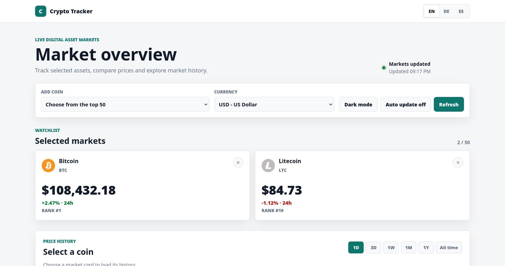
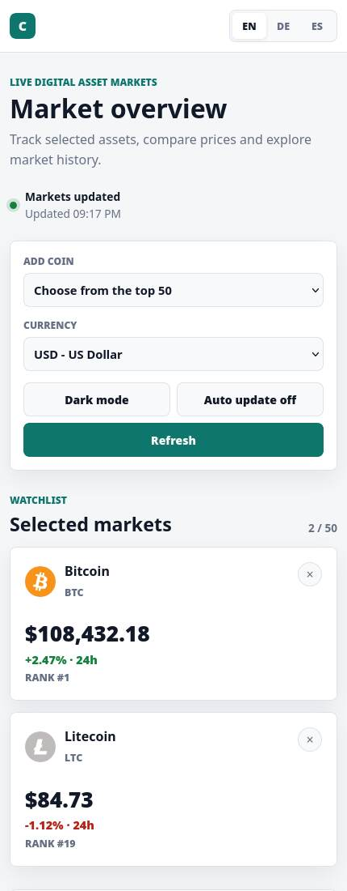

# Crypto Price Tracker

A responsive market dashboard for tracking cryptocurrencies with live prices and historical charts.

The app uses plain HTML, CSS and JavaScript. It has no build step, package manager or backend.

## Screenshots

### Desktop market dashboard



### Responsive mobile view



> Screenshots use representative market data for a deterministic UI capture.

## Features

- Bitcoin and Litecoin selected by default
- Dropdown containing the top 50 cryptocurrencies by market capitalization
- Add and remove market cards dynamically
- Five fiat currencies:
  - USD
  - EUR
  - GBP
  - JPY
  - CHF
- Complete interface translations:
  - English
  - German
  - Spanish
- Current price and 24-hour change
- Historical charts for:
  - 1 day
  - 3 days
  - 1 week
  - 1 month
  - 1 year
  - all time
- Hover tooltips with timestamp and price
- Dark mode with saved preference
- Optional five-minute auto-update
- Responsive desktop and mobile layout
- Donation wallets with local CC0 coin icons

## Project structure

```text
crypto-tracker/
├── assets/
│   └── icons/
│       ├── btc.svg
│       ├── ltc.svg
│       ├── sol.svg
│       └── xmr.svg
├── screenshots/
│   ├── dashboard-desktop.svg
│   └── dashboard-mobile.svg
├── index.html
├── styles.css
├── script.js
├── LICENSE
└── README.md
```

## Data source

The app uses the public CoinGecko API.

Top-50 market data and fiat prices:

```text
https://api.coingecko.com/api/v3/coins/markets
```

Historical prices:

```text
https://api.coingecko.com/api/v3/coins/{coin-id}/market_chart
```

The top-50 list is ordered by market capitalization and refreshed together with the displayed prices.

## Run locally

Start a static web server in the project directory:

```bash
python3 -m http.server 8001
```

Open:

```text
http://127.0.0.1:8001/
```

If port `8001` is unavailable, use another port:

```bash
python3 -m http.server 8080
```

## Usage

1. Bitcoin and Litecoin are shown after the first market request.
2. Use `Add coin` to add another asset from the current top 50.
3. Remove an asset with the close button on its market card.
4. Select USD, EUR, GBP, JPY or CHF from the currency dropdown.
5. Use EN, DE or ES in the top bar to translate the interface.
6. Select a market card to load its historical chart.
7. Enable auto-update to refresh market prices every five minutes.

## Rate-limit behavior

- One top-50 market request updates every displayed card.
- Auto-update uses a conservative five-minute interval.
- Auto-update pauses while the browser tab is hidden.
- Failed market requests use a ten-minute retry delay.
- Historical data is cached per coin, fiat currency and time range for the current session.

## Image source

The local coin icons in `assets/icons/` come from the `cryptocurrency-icons` project and are licensed under `CC0-1.0`.

## License

This project is licensed under the GNU General Public License v3.0 or later (`GPL-3.0-or-later`).

FOSS is freedom. Sharing is caring.
